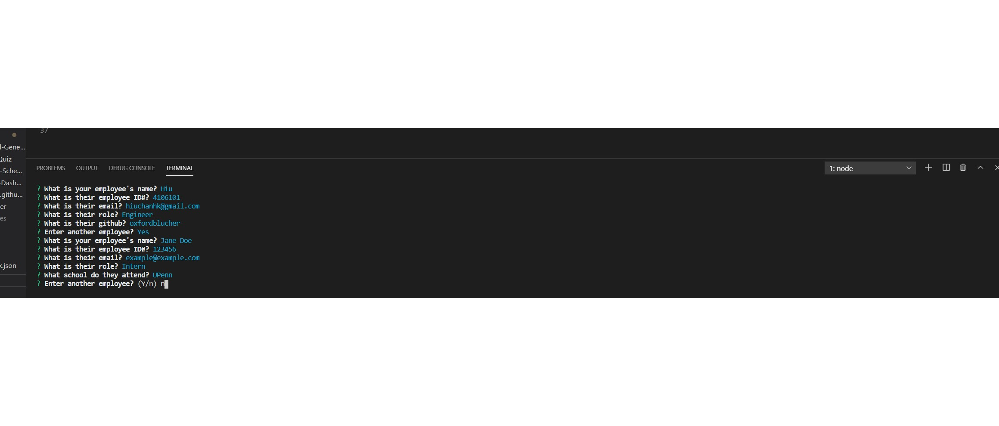

# Employee Overview Template  

## Description
An easy way to track and organize the hierarchy of your team. This is a CLI app that creates a HTML file that displays a nicely formatted team roster based on user input. 

## Table of Contents
*[Installation](#Installation)  
*[Usage](#Usage)  
*[Contribution Guidelines](#Contribution&nbsp;Guidelines)  
*[Testing](#Testing)  
*[Questions](#Questions)  

## Installation
This application requires the use of jest for running the provided tests and inquirer for collecting user input. Both modules can be installed with the "npm install" command.

## Usage
Run app.js in your terminal and answer the questions as they come. The rest is automated for you.

## Contribution Guidelines
n/a

## Testing
There were tests to ensure our templates were fully operational but seeing as this app was built through test-driven development, it's safe to say those will be unnecessary.

## Questions
1. What is your (the creator's) github?
Hiu Chan
[oxfordblucher](https://github.com/oxfordblucher "oxfordblucher")

2. How do I get in contact?
I am always available by email: hiuchanhk@gmail.com

## License
MIT License
